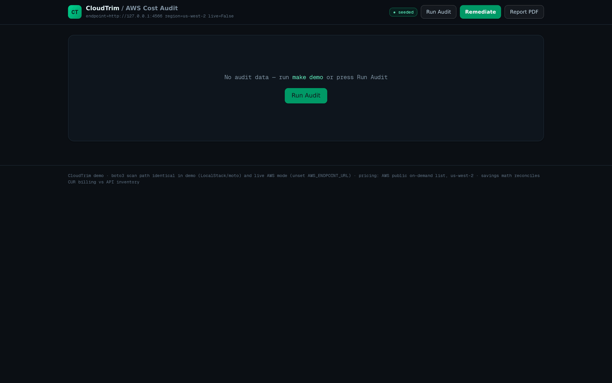
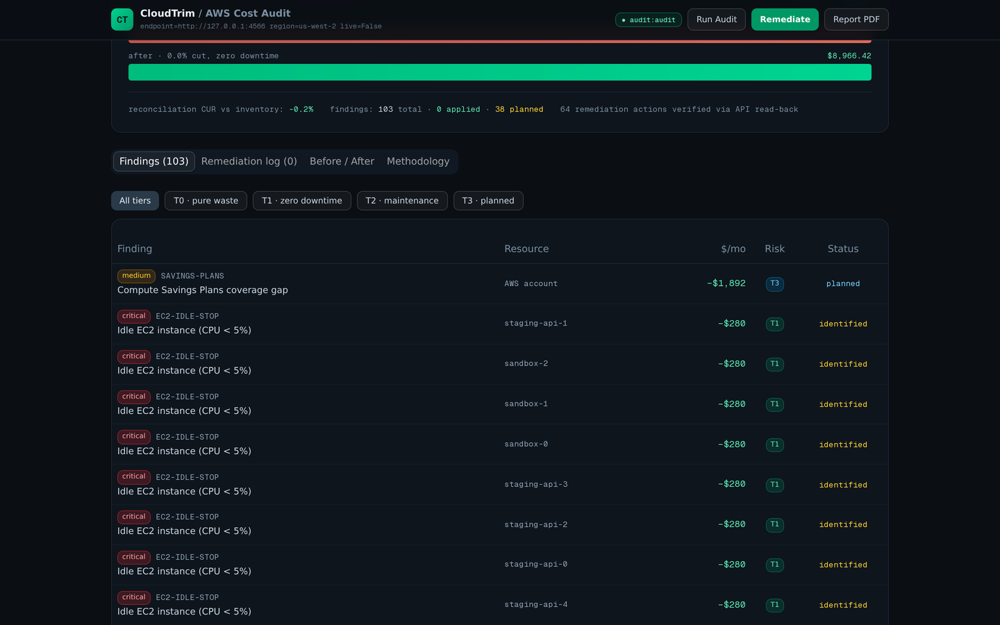
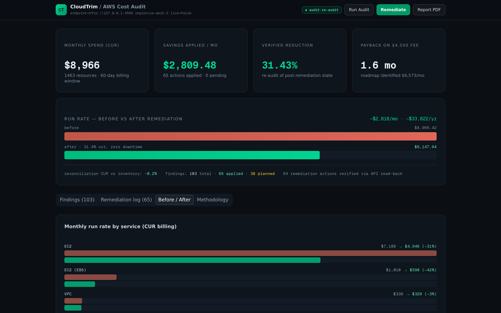

# CloudTrim — Productized Cloud Cost Audit

**One-week, fixed-fee AWS audits for startups. Cut cloud spend 30% with zero downtime.**

[](https://codespaces.new/adventurewave-labs/cloudtrim)

This repo is the full working product demo: an audit engine (real boto3, real Terraform),
a dashboard, a billing-grade cost model, and a verifiable remediation pipeline — packaged
to run anywhere with `docker compose` (GitHub Codespaces, laptops, CI).

The full engagement, recorded live from the dashboard (seed → audit → remediate → verified
before/after — every number below is measured, not mocked):



---

## The proof (measured, not claimed)

The demo seeds a realistic 18-month-old startup AWS account (26 EC2 instances, 31 volumes,
22 snapshots, 2 ALBs, 4 S3 buckets, 3 log groups, 2 NAT gateways — provisioned by
**real `terraform apply`**), then runs the complete audit engagement:

| Stage | What happens | Measured result |
|---|---|---|
| **Connect** | `terraform apply` provisions the wasteful account; 14 days of CloudWatch telemetry + a 60-day CUR billing export are generated from live API state | 110 infra resources, baseline **$8,738.90/mo** |
| **Audit** | Read-only boto3 inventory scan (paginated describe calls), CUR parsing, 22-rule catalog evaluation, bottom-up cost model cross-check | **99 findings**, CUR-vs-inventory reconciliation **−0.2%** |
| **Remediate** | Tier 0/1 actions applied via real AWS API calls, each **verified by read-back**; Terraform remediation modules (1.5+ `import` blocks) generated as client artifacts | **64/64 actions verified**, 0 pending |
| **Verify** | CUR regenerated from post-remediation state, full re-audit | **$8,738.90 → $5,951.67/mo = 31.89% verified reduction** ($33,447/yr) |

Zero customer-facing downtime: every applied action is Tier 0 (pure waste) or Tier 1
(in-place AWS operations). Tier 2/3 roadmap (rightsizing, NAT consolidation, Graviton,
Spot, Savings Plans — worth ~$3.6k/mo more) is identified, costed, and scheduled, never
blindly executed.

## Quickstart

**GitHub Codespace** (recommended): open this repo in a Codespace. The devcontainer
brings up Docker, starts the stack, and forwards ports. Then:

```bash
make demo          # seed -> audit -> remediate -> verify (3-5 minutes)
```

Open **http://localhost:3000** — the dashboard shows the audit, findings, remediation
log, and the before/after proof.

**Any Docker host:**

```bash
docker compose up -d --build
docker compose exec engine cloudtrim demo
```

**CLI-only (no dashboard):**

```bash
docker compose exec engine cloudtrim demo      # full pipeline
docker compose exec engine cloudtrim status    # scan history + pipeline state
```

Artifacts land in `engine/output/`:
- `cloudtrim-audit-report.pdf` — the client-facing audit report (the fixed-fee deliverable)
- `terraform/<stamp>-remediation/` — generated, reviewable Terraform remediation modules

## How to read this demo

Three layers, all real:

1. **The account is real infrastructure** — created by `terraform apply`
   (`engine/terraform/seed/`), not JSON fixtures. Telemetry (CloudWatch) and billing
   (CUR CSV in the AWS Cost & Usage Report schema) are generated from live API state,
   which is what an emulator can't natively provide.
2. **The code path is production code.** The engine talks to AWS through one seam
   (`cloudtrim/aws.py`): with `AWS_ENDPOINT_URL` set it points at the AWS-compatible
   emulator (LocalStack in compose); unset, the identical code scans a real AWS
   account through the standard credential chain.
3. **The money math reconciles.** Savings come from real us-west-2 list pricing times
   live inventory, cross-checked against the CUR billing file every audit. The
   reconciliation variance is printed in the report (typically < ±0.5% here; in live
   audits it catches CUR lag and pricing drift).

What's deliberately demo-only: the emulator itself (LocalStack), the seeded telemetry
and billing history, and live-only rules (RDS, ElastiCache, Lambda concurrency) that
evaluate quietly where the APIs aren't emulated. Everything else — scanning, rules,
remediation, verification, reporting — is the shipped code.

## Running against a real AWS account (live mode)

```bash
cd engine
pip install .
unset AWS_ENDPOINT_URL          # no emulator
export AWS_PROFILE=client-acct  # read-only IAM role recommended
cloudtrim audit                 # read-only scan + CUR parse + findings
cloudtrim report                # client-ready PDF
```

IAM policy for the audit phase: read-only describe/list/get on ec2, elbv2, s3, logs,
cloudwatch, ce, cur. Remediation requires scoped write actions (stopInstances,
deleteVolume, deleteSnapshot, releaseAddress, deleteLoadBalancer, modifyVolume,
PutBucketLifecycleConfiguration, AbortMultipartUpload, PutRetentionPolicy) — apply
them through the engine or the generated Terraform modules via your CI.

## Architecture

```
docker compose
├── localstack   LocalStack 3.8.1 (pinned) — AWS-compatible API endpoint
├── engine       Python 3.12 + Terraform 1.9 — cloudtrim package
│   ├── aws.py           endpoint-agnostic boto3 client factory (the demo/live seam)
│   ├── scanner.py       paginated read-only inventory + CloudWatch telemetry
│   ├── cur.py           CUR 2.0 parser + state-derived billing generator
│   ├── pricing.py       us-west-2 list prices (refreshable via Pricing API)
│   ├── rules.py         22-rule catalog, 4 risk tiers, evidence-backed findings
│   ├── audit.py         pipeline + CUR-vs-inventory reconciliation
│   ├── seeder.py        terraform apply + telemetry + billing seed
│   ├── remediate.py     action executor with read-back verification
│   ├── terraform_gen.py import-block remediation modules (Terraform 1.5+)
│   ├── report.py        client PDF report (ReportLab)
│   ├── api.py           FastAPI service (port 8000)
│   └── cli.py           cloudtrim seed|audit|remediate|report|demo|serve
└── web          Next.js 16 standalone — dark-fintech dashboard (port 3000)
```

The SQLite store (`engine/data/cloudtrim.db`) is the audit record: scans, findings,
every remediation action with before/after state and verification verdict.

## The 22-rule catalog (summary)

| Tier | Rules |
|---|---|
| **T0 pure waste** | unattached EBS volumes · stale snapshots (billed ≥45d) · unused AMIs + snapshots · orphaned EIPs · idle ALBs (0 targets) · incomplete S3 multipart uploads |
| **T1 zero downtime** | idle EC2 (CPU<5% over 14d) · gp2→gp3 in-place conversion · S3 lifecycle coldening · CloudWatch log retention |
| **T2 maintenance** | rightsizing (5–20% CPU) · oversized volumes (near-zero I/O) · NAT consolidation · long-stopped instance cleanup |
| **T3 planned** | Graviton migration · Spot for stateless fleets · Savings Plans coverage · (+ live-only: RDS idle, RDS gp3, ElastiCache, Lambda concurrency, classic ELB) |

Full specification with detection logic and savings formulas: see the PRD
([`docs/cloudtrim-prd.pdf`](docs/cloudtrim-prd.pdf)).

## Screenshots

| Findings, evidence-backed | Verified before / after |
|---|---|
| [](docs/dashboard-findings.png) | [](docs/dashboard-before-after.png) |
| The 22-rule catalog in action: tier filters, per-finding evidence, one-click remediation. | CUR-to-CUR proof: $8.7k → $5.9k/mo, each action verified by API read-back. |

## Verified test environments

- **moto 5.2.3** (AWS API emulator, in-process): full E2E — the measured numbers in
  this README come from this run.
- **LocalStack 3.8.1** (docker-compose): the shipped demo target. Community-edition
  API coverage; any remediation action the emulator can't land stays `pending` in the
  audit log — the engine never claims a change it couldn't verify.
- **Terraform 1.9.8**: seed module (110 resources) and generated remediation modules
  (import blocks) both applied successfully.

## Repository layout

```
engine/            audit engine (Python package, Dockerfile, terraform modules)
src/               Next.js dashboard
docker-compose.yml the portable stack
.devcontainer/     Codespace bootstrap (docker-in-docker, auto compose up)
Makefile           make up / demo / audit / remediate / report
docs/              demo GIF, dashboard stills, the PRD (cloudtrim-prd.pdf)
```

## Positioning

CloudTrim is the delivery engine for a productized consulting practice: fixed-fee
tiers ($3k Lite / $5k Standard / $8k Deep-dive), one-week turnaround, guaranteed
zero-downtime remediation, Terraform-native artifacts the client keeps.

Private repository — AdventureWave Labs. Not for distribution.
